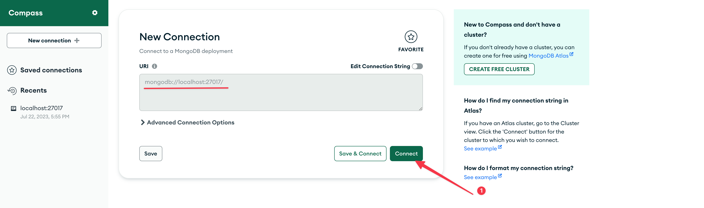

# Smart Maple Python Developer Task - Serhat Keskin

---

# *Lütfen Bu Dokümantasyon Belgesinin Orijinal Halini Aşağıdaki Linkten Notion Üzerinde İnceleyiniz*

***Notion Linki:*** [https://serhatkeskin.notion.site/Smart-Maple-Python-Developer-Task-Serhat-Keskin-624d43d79f234c22a73ffbb9f5a8b14b?pvs=4](https://serhatkeskin.notion.site/Smart-Maple-Python-Developer-Task-Serhat-Keskin-624d43d79f234c22a73ffbb9f5a8b14b?pvs=4)

---

---

<aside>
💡 Bu projeyi MacOS Big Sur 11.7.8 işletim sisteminde geliştirdim. O yüzden bazı özellikler (crontab) Windows veya başka bir işletim sisteminde olmayabilir.

Ayrıca isteğe bağlı olarak anaconda venv kullandım.

</aside>

## DOKÜMANTASYON VİDEOSU

***Google Drive Video Linki(Notion üzerinden de izleyebilirsiniz):*** [https://drive.google.com/file/d/1A2GjMoNK6Yioxr8OM8ZYF4Bal9z4BYt9/view?usp=sharing](https://drive.google.com/file/d/1A2GjMoNK6Yioxr8OM8ZYF4Bal9z4BYt9/view?usp=sharing)

# Gereksinimler

### Mongo DB Kurulumu

### Adım #1

[https://www.mongodb.com/docs/manual/administration/install-community/](https://www.mongodb.com/docs/manual/administration/install-community/) adresinden işletim sisteminize uygun olanı dokümanı takip ederek kurun ve ardından ilgili komutlarla  servisi başlatın. Ve böylelikle db nizi akif hale getirin.

> Ben MacOS cihazımda `brew` kullanarak kurup çalıştırdım
> 

### Adım #2

[https://www.mongodb.com/try/download/compass](https://www.mongodb.com/try/download/compass) adresinden işletim sisteminize uygun olan MongoDB Compass’I dokümanı takip ederek kurun.

### Adım #3

MongoDB Compass programını açın ve size verilen varsayılan konfigürasyonu kullanarak bağlanın. Db nizi bağlandıktan sonra mongodb compass'in grafiksela arayüzü üzerinden databaseler, collectionlar oluşturup verilerinizi görebilirsiniz.



varsayılan ayarları ellemeden “*connect*” diyin

---

Yeni bir database oluşturmak için ilgili yere tıklayın


*Database* adına “smartmaple” *Collection* adına da oluşturacağımız 2 collectiondan(”kitapyurdu”, ”kitapsepeti”) birinin adını verin ve db’yi oluşturun.


ardından diğer collection’ı da oluşturun


artık her şey tamam, ilerleyebiliriz ✅

### Python Environment’ı, Interpreter’ı Kurulumu(Bonus)

> Virtual Environment kullanmak zorunda değilsiniz ama iyi bir pratik olduğu için ben Anaconda ile bu projeye özgü bir Virtual Environment oluşturup bunu kullandım. Hali hazırda bir python interpreter’ının sisteminizde yüklü olduğunu varsayıyorum o yüzden bu kısmı bonus olarak değerlendirebiliriz
> 

Anaconda ile Virtual Environment kurmak için aşağıdaki linkten kendi sisteminize uygun versiyonunu indirip, kurabilirsiniz.

[Free Download | Anaconda](https://www.anaconda.com/download)

Anaconda Navigator’ı açıp grafiksel arayüzden ilgili kısma gelip kendi venv(Virtual Environment)’mizi oluşturuyoruz.


Terminal’i açıyoruz. (Windowsta eğer anacondayı yüklerken PATH’e anacondayı eklemediyseniz Windows Terminaline “conda” yazdığınızda bu anahtar kelimeyi tanımayacaktır buna alternatif olarak anaconda’nın gömülü olduğu “Anaconda Prompt”(Windows’un arama kısmına yazarak bulabilirsiniz)uygulamasını çalıştırıp komutları burada yazabilirsiniz.

### Oluşturduğumuz venv’yi aktif etme

`conda activate <venv’nizin adı>` yazarak venv’nizi aktif hale getirebilirsiniz. Artık tamam şimdi kütüphaneleri kurma adımına geçebiliriz. Unutmayın venv kullanıyorsanız kütüphaneleri venv’niz aktifken kurmalısınız.

- Uygulama
    
    Benim terminalimde varsayılan olarak anacondanın varsayılan venv’si olan “base” isim venv aktif
    
    
    
    ---
    
    komutu yazıyoruz…(benim venv’min adı: “webscrapping”)
    
    
    
    ve enter’a bastık
    
    ---
    
    
    
    hem terminalimin sağındaki bilgi ekranımda hem de `conda info` komutuyla da gördüğüm gibi artık kullanmak istedğim venv aktif ✅
    

### Python Kütüphanelerinin Kurulumu

<aside>
💡 Venv kullanıyorsanız venv’niz aktifken bu komutları çalıştırmalısınız. Kullanmıyorsanız bu notu göz ardı edebilirsiniz.

</aside>


Terminalden kodun bulunduğu dosyaya gelin. Sonrasında ise “requirements.txt” dosyasının bulunduğu konumda olduğunuzdan emin olunuz. 

python 3 kullanmak için hangi anahtar kelimeyi kullanıyorsanız o anahtar kelimeyle devam edin benim işletim sistemimde bu “python3” package installer’ı pip için ise “pip3”. Bu sizde “python” ve “pip” de olabilir. Terminale python ve python3 yazarak hangi python sürümlerini çalıştırdıklarını test edebilirsiniz.(tabii bu anahtar kelimeler terminaliniz tarafından tanınıyorsa)

`pip3 install -requirements.txt` yazarak kütüphaneleri kurabilirsiniz. Sorun yaşarsanız “pip” inizi güncellemeyi deneyebilirsiniz.

Benim işletim sistemim MacOS’da güncellemek için `pip3 install --upgrade pip` yazmanız gerekiyor.

# Kodun Açıklaması

<aside>
💡 Ana kod “app.py” olmak üzere. Kodun temelde 2 kullanım şekli vardır, bunlar aşağıda açıklanmıştır.

</aside>

## User Input’larıyla Kazıma İşlemi Yapma(MANUEL)

<aside>
💡 Kullanıcı etkileşimiyle kodu kullanmak isterseniz bu yolu seçin

</aside>

Terminalden “[app.py](http://app.py)” olduğa dizine gelip `python3 app.py` yazarak çalıştırın. (Unutmayın daha önceden de bahsettiğim gibi python için anahtar kelimeniz sizin için farklı olabilir bende *python3*, sizde *python* olabilir.)

```bash
python3 app.py
```

Ardından ekrana gelen talimatlara göre terminale istediğiniz inputları giriniz. Input’ların hepsini doğru bir şekilde girdiyseniz kazıma işleminiz başarıyla gerçekleşecektir ✅

### [ÖZELLİK] Bölünen veya İptal Edilen Kazıma İşlemine Kaldığın Yerden Devam Etme

Kazıma işlemini kendi isteğinizle (CTRL +C) veya (CTRL + Z) gibi kısayollarla durdurup iptal ederseniz. Veya script çalışırken bir arıza. çökme yaşanırsa. En son kazınılmaya başlanan sayfasının bilgisi ve son işleme dair diğer bilgiler proje klasöründeki “last_session.txt” de kayıtlı olacaktır. Scripti yeniden “python3 app.py” çalıştırdığınızda ekrana bastırılan ilk prompt’tan karşınıza çıkan

*"Son kazıma işleminin kaldığı yerden devam etmek için '1' yazınız. Yeni kazıma işlemi için boş bırakınız. Çıkmak için 'exit' yazınız:”*

kısımda “1” yazarak kaldığınız yerden başarıyla devam edebilirsiniz ✅

## Günün Belirli Bir Saatinde “crontab” İle Python Scriptine Argümanları Vererek Kazıma İşlemi Yapma(OTOMASYON)

<aside>
💡 Linux ve MacOS işletim sistemlerindeki “crontab” özelliği ile scriptleri belirli zaman aralıklarıyla otomatik olarak çalışması için planlayabilirsiniz.

</aside>

### Argümanları Scripti Çalıştırırken Verme

```bash
# Arada boşluklar olacak şekilde
python3 app.py <site> <kategori> <kategori_url_parametresi> <satışta olma durumu> <başlangıç sayfası> <bitiş sayfası>
# Örnek kullanım
python3 app.py kitapyurdu Akademik 1033 1 3 5
```

### Crontab İle Otomasyona Bağlama

terminalden `crontab -e` ile açılan editöre komutumuzu yazıyoruz

- ***Zaman Aralıklarını Kolayca Ayarlama***
    
    crontab komutlarının başındaki `* * * * *`  kısmı zamanlamayla ilgilidir bu kısıma ne yazmanız gerektiğini aşağıdaki siteden kolayca bulup, kullanabilirsiniz.
    
    Link: [https://crontab.guru/](https://crontab.guru/)
    

```bash
# dakikada 1 otomatik olarak çalıştırmak için
* * * * * <python interpreter'ınızın tam yolu> <app.py'ın tam path'i> <site> <kategori> <kategori_url_parametresi> <satışta olma durumu> <başlangıç sayfası> <bitiş sayfası> >> <logları(.log .txt) tutmak istedğiniz dosyanın pathi>
```

```bash
# örnek kullanım
* * * * * /Users/serhatmainpc/opt/anaconda3/envs/webscrapping/bin/python3 /Users/serhatmainpc/Desktop/My_Dev/Smartmaple_Python_Task_Serhat_Keskin/myproject/myproject/app.py kitapyurdu Akademik 1033 1 3 5 >> /Users/serhatmainpc/Desktop/My_Dev/Smartmaple_Python_Task_Serhat_Keskin/myproject/myproject/cron.log
```

---

`crontab -l` ile çalışan mevcut crontab’i görebilirsiniz.

`crontab -r` ile çalışan mevcut crontabi’i silip, deaktif edebilirsiniz.